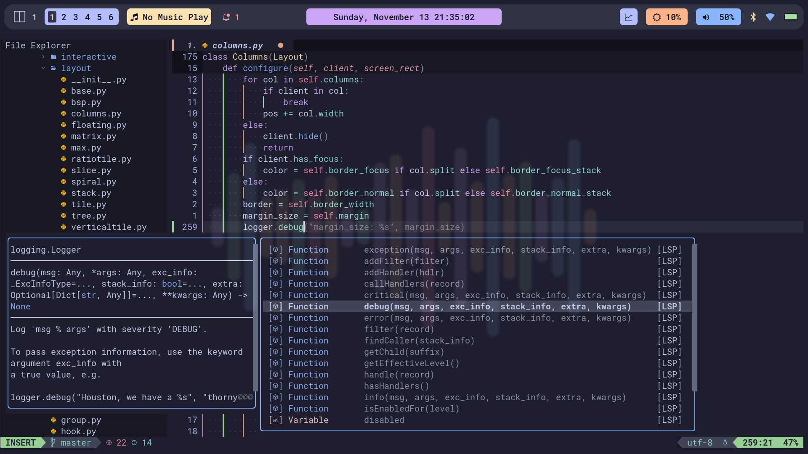

## <a href="https://github.com/nvim-tree/nvim-tree.lua" style="color: blue; text-decoration: underline;">File Tree</a> and \
<a href="https://github.com/hrsh7th/nvim-cmp" style="color: blue; text-decoration: underline;>Completion Menu</a>

## <a href="https://github.com/folke/noice.nvim">Cmdline Popup</a>

