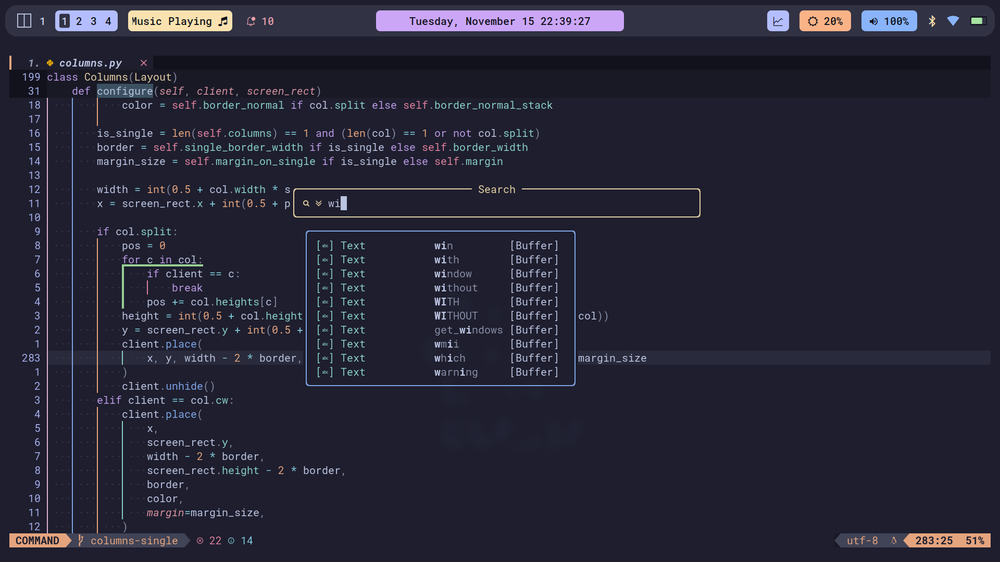
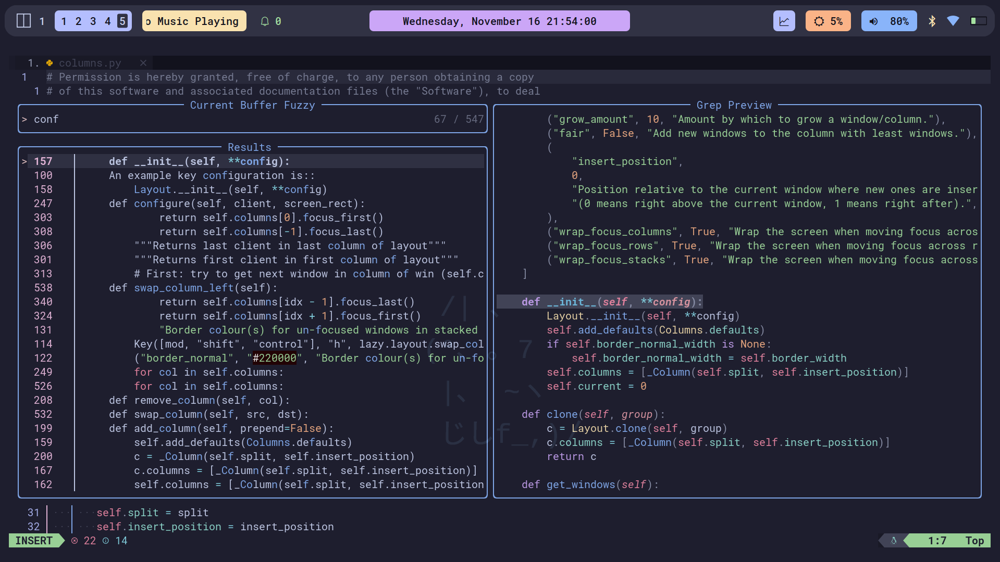
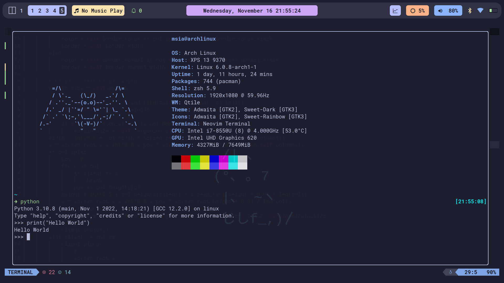

## <a href="https://github.com/nvim-tree/nvim-tree.lua">File Tree</a>    <a href="https://github.com/akinsho/bufferline.nvim">Tabs</a>    <a href="https://github.com/lukas-reineke/indent-blankline.nvim">Indent Lines</a>    <a href="https://github.com/hrsh7th/nvim-cmp">Completion Menu</a>    <a href="https://github.com/nvim-lualine/lualine.nvim">Status Bar</a>

## <a href="https://github.com/folke/noice.nvim">Cmdline Popup</a>

## <a href="https://github.com/nvim-telescope/telescope.nvim">Fuzzy Finder</a>

## <a href="https://github.com/akinsho/toggleterm.nvim">Terminal</a>

## <a href="https://github.com/folke/which-key.nvim">Keybinds</a>

## <a href="https://github.com/norcalli/nvim-colorizer.lua">Colorizer</a>

